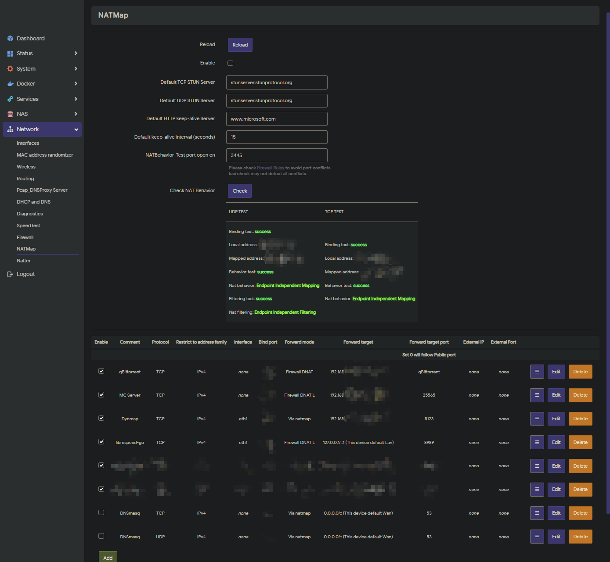

# luci-app-natmap
TCP/UDP port mapping for full cone NAT

> [NATMap][] project is used to establish a TCP/UDP port mapping from ISP NAT public address to local private address. If all layers of NAT are full cones (NAT-1), any host can access internal services through the mapped public address.

## Features included outside of NATMap
- [x] NAT Type Test
- [x] Automatically configure the Firewall
- [x] Transparent Port forward (Forward port = 0)
- [x] Refresh the listen port of the BT Client (Forward port = 0)
- [x] Port update notify script
- [ ] A Record update script
- [ ] AAAA Record update script
- [ ] SRV Record update script
- [ ] HTTPS Record update script

## Screenshots

  

## Depends

1. [natmapt][]
2. coreutils-timeout
3. [stuntman-client][]

## How to install

1. Go to [here](https://fantastic-packages.github.io/packages/)
2. Download the latest version of ipk
3. Login router and goto **System --> Software**
4. Upload and install ipk
5. Reboot if the app is not automatically added in page
6. Goto **Network --> NATMap**

## Build

Compile from OpenWrt/LEDE SDK

```
# Take the x86_64 platform as an example
tar xjf openwrt-sdk-21.02.3-x86-64_gcc-8.4.0_musl.Linux-x86_64.tar.xz
# Go to the SDK root dir
cd OpenWrt-sdk-*-x86_64_*
# First run to generate a .config file
make menuconfig
./scripts/feeds update -a
./scripts/feeds install -a
# Get Makefile
git clone --depth 1 --branch master --single-branch --no-checkout https://github.com/muink/luci-app-natmapt.git package/luci-app-natmapt
pushd package/luci-app-natmapt
umask 022
git checkout
popd
# Select the package LuCI -> Applications -> luci-app-natmapt
make menuconfig
# Start compiling
make package/luci-app-natmapt/compile V=99
```

## Collaborators

[Richard Yu](https://github.com/ysc3839)  
[Anya Lin](https://github.com/muink)  

[NATMap]: https://github.com/heiher/natmap
[natmapt]: https://github.com/muink/openwrt-natmapt
[stuntman-client]: https://github.com/muink/openwrt-stuntman

## License

This project is licensed under the [Apache-2.0](https://www.apache.org/licenses/LICENSE-2.0)
